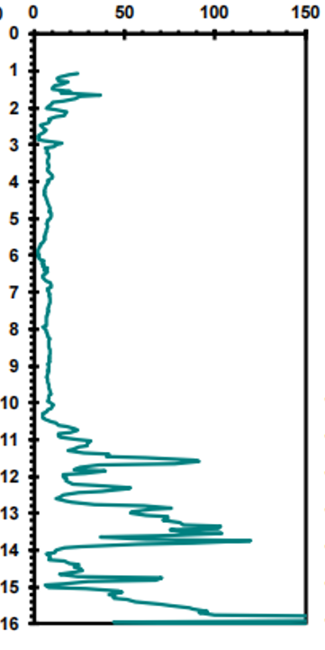
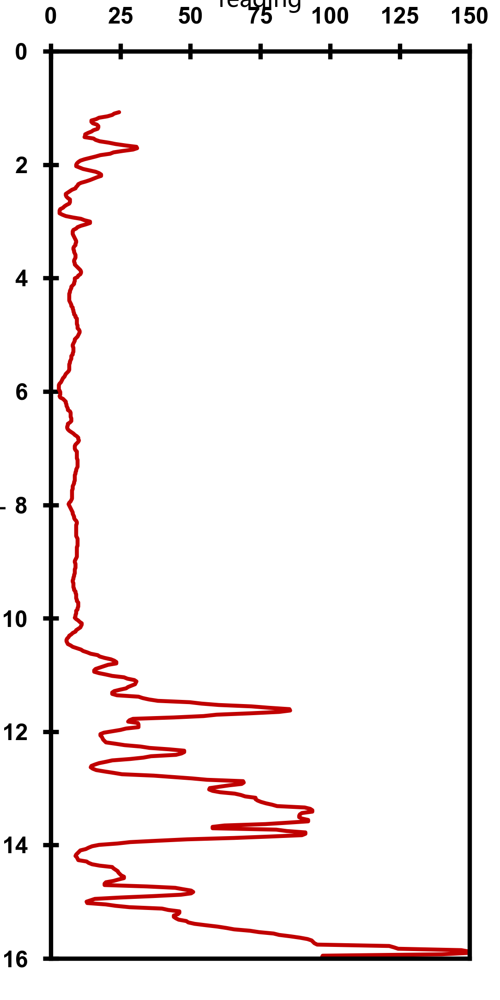
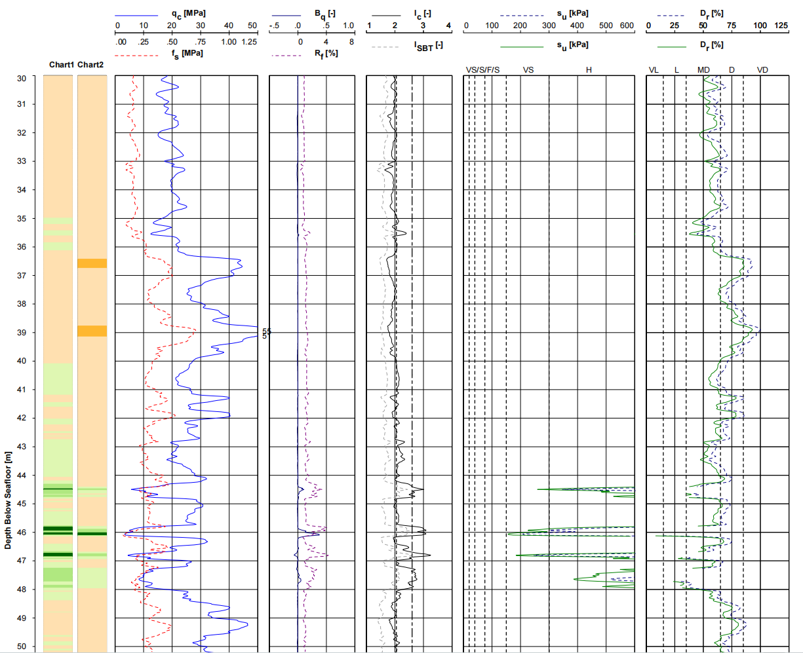
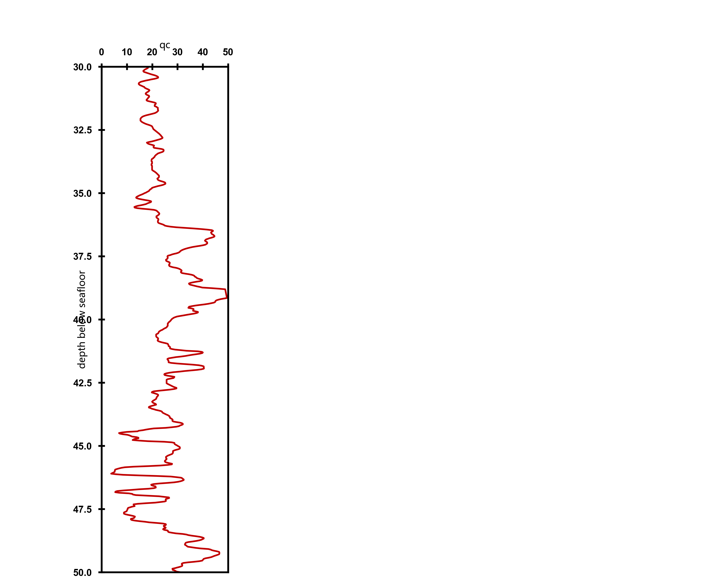
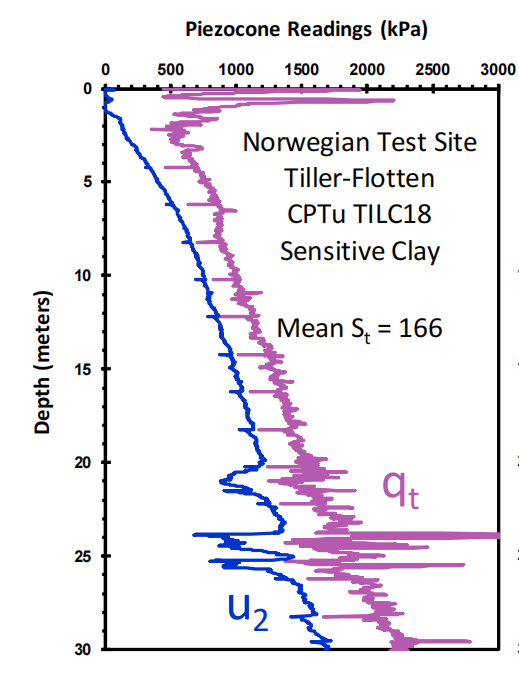
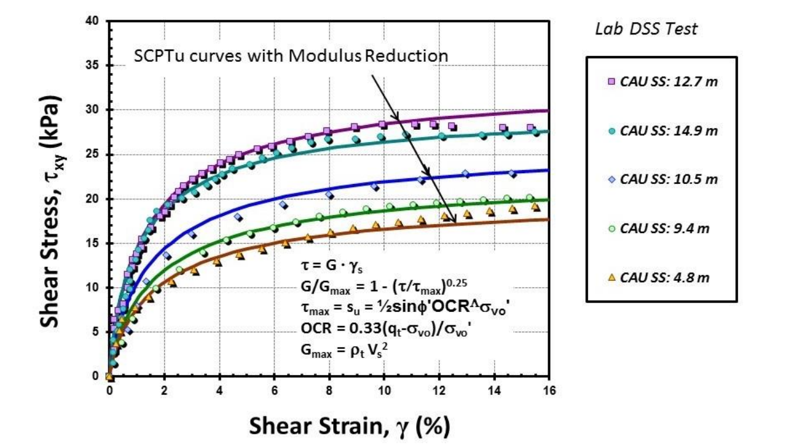
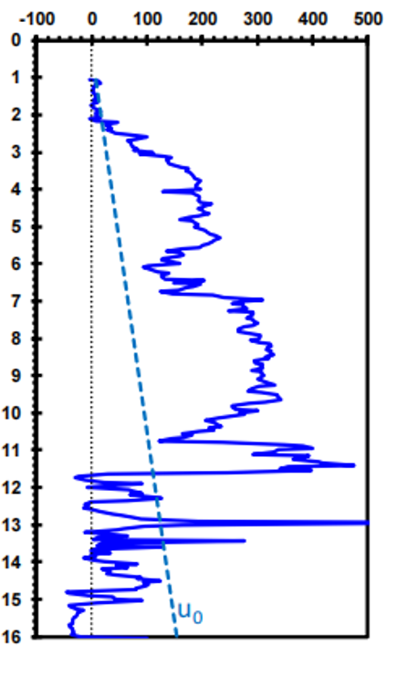
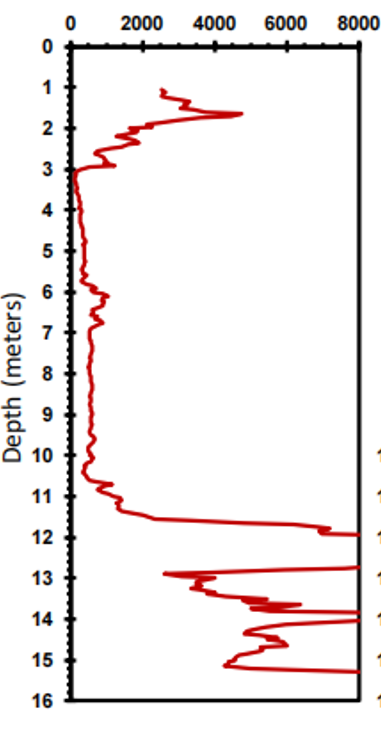

# Digitize Curve Excel Skill

Codex skill for deterministic digitization of plotted curves from raster chart images into XLSX data, validation overlays, redraws, and accuracy audit reports.

The installable skill lives under:

```text
skills/digitize-curve-excel/
```

## What It Supports

- Fast batch extraction for exploratory multi-curve work.
- High-precision single-curve extraction with strict QA.
- Custom RGB/Lab color centers, data-coordinate ROI, and pixel ROI.
- Depth profiles, normal XY curves, dashed curves, straight references, marker series, and multi-series plots.
- Accuracy runner outputs with final XLSX, redraw, overlay, audit JSON, and next-step reports.

## Precision Modes

- `fast_batch`: faster, supports `multi_series`, but multi-series strict QA is limited.
- `high_precision`: slower, splits curves into single targets where possible and uses stricter mask/profile QA.

If a user explicitly accepts a redraw or overlay that still has conservative strict-QA failures, report it as `user_visual_accepted`; do not label it as strict PASS.

## Test Effect Gallery

Representative source charts and output examples are included under [`examples/test-effects/`](examples/test-effects/).

### High-Precision Strict PASS

The teal depth-profile example passes strict QA and produces final XLSX, overlay, redraw, and audit artifacts.





### User-Visual-Accepted Example

The CPT `qc` example demonstrates the intended reporting distinction: the redrawn curve is visually usable, while strict QA may still flag conservative row-gap failures on noisy depth profiles.





### Additional Source Fixtures

These images exercise multi-series plots, same-color labels, dashed references, marker curves, and depth-profile extraction.









## Dependencies

Install Python dependencies with:

```bash
pip install -r requirements.txt
```

Python 3.10 or newer is recommended.

## Validation

Run a basic syntax check:

```bash
python -m compileall skills/digitize-curve-excel/scripts
```

If you have benchmark fixtures, run:

```bash
python skills/digitize-curve-excel/scripts/run_regression_cases.py --benchmark-root path/to/workspace
```

The benchmark helper expects pre-existing `benchmark_runs/<case_id>/case_config.json` fixtures. Full private benchmark runs and generated audit directories are not included in this repository; the gallery above contains only a small set of representative test-effect images.

## Repository Notes

The skill folder intentionally contains only `SKILL.md`, `agents/`, and `scripts/`. Repository-level documentation, license, dependency files, and ignored generated artifacts live outside the skill folder.
